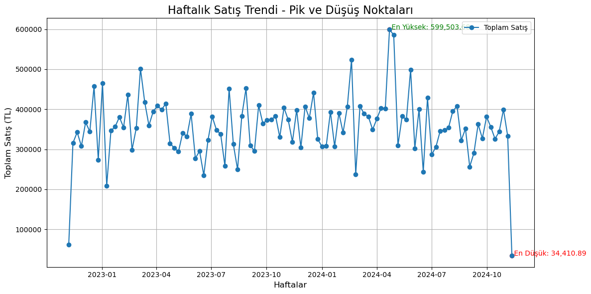

## Görev 1: Veri Temizleme ve Manipülasyonu

### 1. Hatalı Değerlerin Düzeltilmesi
- **"fiyat" ve "toplam_satis"** sütunlarındaki sayıya dönüştürülemeyen değerler tespit ettim.
- **"toplam_satis"** sütunundaki hatalı girişler, **"fiyat"** ve **"adet"** çarpımıyla düzelttim.
- **"fiyat"** sütunundaki hatalı girişler, sütunun medyan değeriyle doldurdum.

### 2. Aykırı Değer Analizi
Aşağıdaki sütunlar için aykırı değerleri tespit ettim:
- **Müşteri Yaşı (yas)**
- **Müşteri Harcama Miktarı (harcama_miktari)**
- **Satış Fiyatı (fiyat)**
- **Toplam Satış (toplam_satis_kontrol)**
- **Satış Adedi (adet)**

#### Aykırı Değer Analizinde Yapılan İşlemler:
- Her bir sütun için aykırı değerlerin sayısını belirledim.
- Alt ve üst sınırlar hesapladım.
- **Winsorization İşlemi**:
  - Alt ve üst sınırlar kullanılarak aykırı değerler belirli bir aralığa çektim.

---

## Görev 2: Zaman Serisi Analizi

- Verilen zaman serisi verisinde belirli haftalarda pik değerler ve düşüşler analiz ettim.
- 

---
